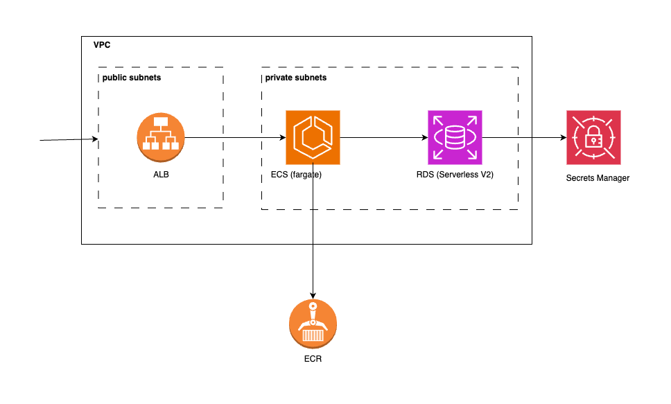

## Architecture Diagram



## Module Dependencies

- VPC, ECR
- RDS -> VPC
- ALB -> VPC
- ECS -> RDS & ALB & VPC

## Run

> Add `alias tf="terraform"` to `~/.zshrc`.

**Validate config**:

```sh
tf format
tf validate
```

**Run dev**:

```sh
tf init -var-file="environments/dev/terraform.tfvars"
tf plan -var-file="environments/dev/terraform.tfvars"
tf apply -var-file="environments/dev/terraform.tfvars"
```

**Run prod**:

```sh
tf init -var-file="environments/prod/terraform.tfvars"
tf plan -var-file="environments/prod/terraform.tfvars"
tf apply -var-file="environments/prod/terraform.tfvars"
```

## TODO

### RDS

- [ ] alarms

### ALB

- [ ] configure SSL/TLS certificate, 443
- [ ] alarms

### ECS

- [ ] alarms
- [ ] move to private subnets and link to NAT to access ECR images